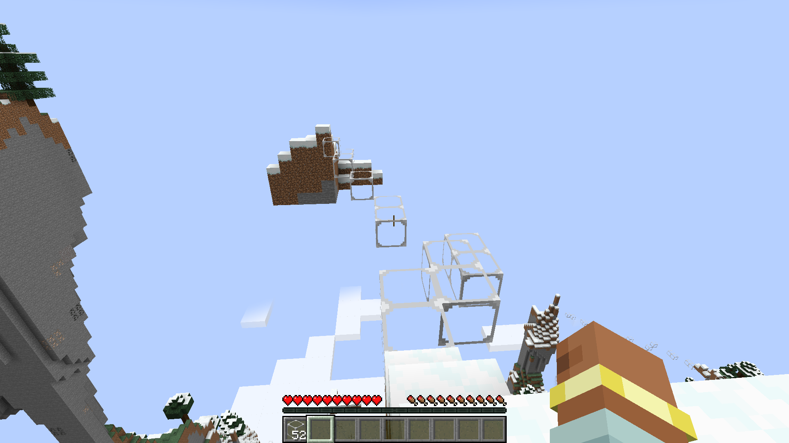

# Angelus

English | [日本語](README.ja.md)

Adds one block that can be placed in mid-air. Right-click with nothing under the
crosshair and the block appears in front of you. It breaks instantly and goes into
your inventory.

- It reaches as far as an ordinary block would.
- It goes into water, tall grass and snow as well as air.
- You can see through the frame.
- Four feathers and four sticks make one.
- There is nothing to configure.

## Screenshots



The rest are in [branding/gallery](branding/gallery), with their captions in
[captions.md](branding/gallery/captions.md).

## Target

| | |
|---|---|
| Minecraft | 1.21.1 |
| Loader | NeoForge 21.1.248 |
| Java | 21 |

## Build

```
run.bat                         # compile and launch a dev client
gradlew build                   # produce the jar
gradlew runGameTestServer       # run every game test, headless, then exit
gradlew runData                 # regenerate blockstate, models, recipe, language, test stage
python tools/make_textures.py   # regenerate the block sprite
```

`JAVA_HOME` must point at a JDK 21, or `java` must be on `PATH`.
Run the texture script before `runData`.

## License

MIT.
